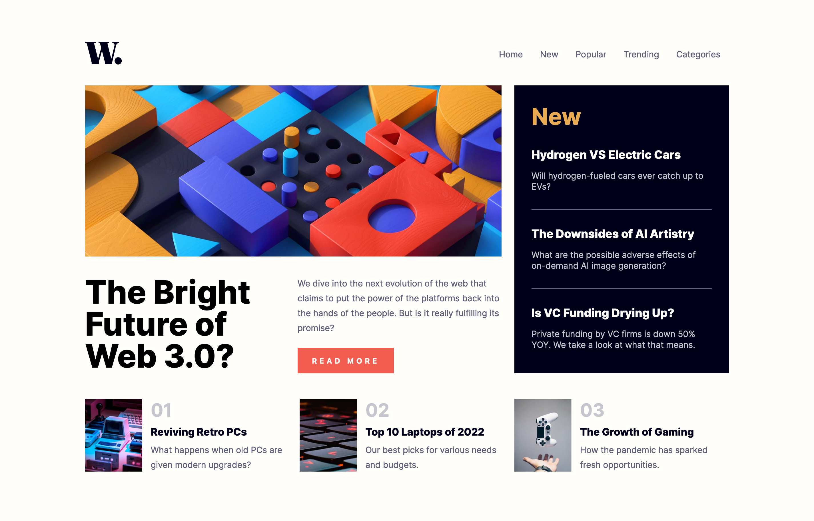
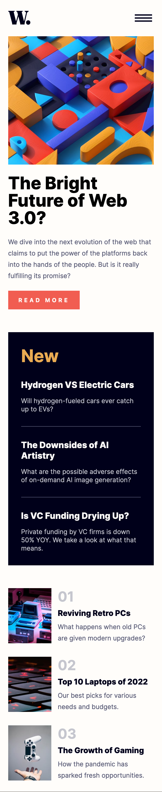
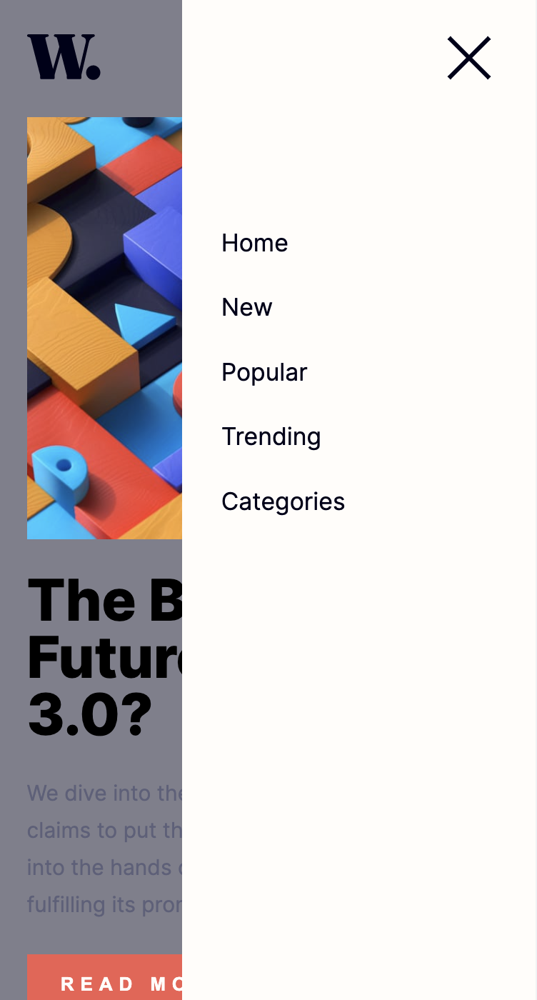

# Frontend Mentor - News homepage solution

This is a solution to the [News homepage challenge on Frontend Mentor](https://www.frontendmentor.io/challenges/news-homepage-H6SWTa1MFl). Frontend Mentor challenges help you improve your coding skills by building realistic projects. 

## The challenge

Users should be able to:

- View the optimal layout for the interface depending on their device's screen size
- See hover and focus states for all interactive elements on the page

## Screenshot
### Desktop


### Mobile


### Mobile Menu


## Built with

- CSS Grid for overall layout
- CSS Flexbox for individual components
- [React](https://reactjs.org/)
- [SASS](https://sass-lang.com/)

## What I learned

This project provided a great opportunity to practice using CSS Grid and grid template areas.

```css
.App {
    grid-template-columns: 2fr 1fr;
    grid-template-rows: repeat(3, auto);
    grid-template-areas: 
        "header header"
        "main new"
        "suggested suggested";
}
```